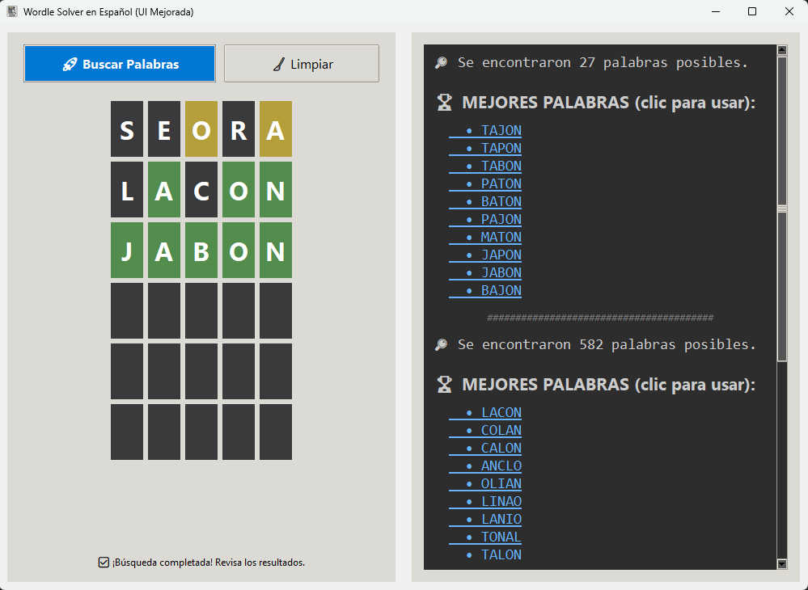

# Wordle Solver en Español


Un asistente de escritorio con interfaz gráfica para ayudarte a resolver los puzles de Wordle en español, sugiriendo las mejores palabras posibles basadas en tus intentos.

---

 
## Descripción

Este programa proporciona una interfaz gráfica intuitiva para introducir las pistas que obtienes en cada intento de Wordle. Basándose en las letras correctas (verdes), presentes (amarillas) y ausentes (grises), filtra un completo diccionario en español para mostrarte una lista de posibles soluciones. Además, clasifica las soluciones para sugerirte las palabras más estratégicas a usar en tu siguiente intento.

## Características Principales

* **Interfaz Gráfica Interactiva**: Un tablero de 6x5 para introducir tus intentos fácilmente.
* **Feedback Visual Claro**: Cambia el color de cada letra con un simple **clic derecho** para que coincida con los resultados de Wordle (Gris: Ausente, Amarillo: Presente, Verde: Correcta).
* **Sugerencias Inteligentes**: Muestra una lista clasificada con las 10 mejores palabras para probar a continuación, maximizando tus posibilidades de acierto.
* **Clic para Rellenar**: Haz clic en una de las palabras sugeridas para que se rellene automáticamente en la siguiente fila vacía del tablero.
* **Historial de Búsquedas**: El panel de resultados conserva el historial de tus búsquedas para que puedas revisar el proceso.
* **Empaquetado Sencillo**: Incluye scripts para compilar la aplicación en un único archivo ejecutable (`.exe`) para una fácil distribución.

## Instalación

Puedes usar la aplicación de dos maneras: descargando el ejecutable o ejecutando el código fuente.

### Opción 1: Para Usuarios (Recomendado)

1.  Ve a la sección de **[Releases](https://github.com/joseluisbugallo/wordle_resolver/releases)** de este repositorio.
2.  Descarga el archivo `.exe` de la última versión.
3.  ¡Ejecútalo y a jugar! No se necesita instalar nada más.

### Opción 2: Para Desarrolladores (Ejecutar desde el código fuente)

Si prefieres ejecutar el código directamente, necesitarás tener Python 3 instalado.

1.  **Clona el repositorio:**
    ```sh
    git clone [https://github.com/joseluisbugallo/wordle_resolver.git](https://github.com/joseluisbugallo/wordle_resolver.git)
    cd tu-repositorio
    ```

2.  **Crea y activa un entorno virtual:**
    ```sh
    # Crear el entorno
    python -m venv venv

    # Activar en Windows
    .\venv\Scripts\activate

    # Activar en macOS/Linux
    source venv/bin/activate
    ```

3.  **(Opcional) Instala las dependencias:**
    Este proyecto no tiene dependencias externas para su ejecución, pero necesitarás `pyinstaller` si quieres compilarlo. Puedes instalarlo con:
    ```sh
    pip install pyinstaller
    ```

4.  **Ejecuta la aplicación:**
    ```sh
    python wordle_resolver_gui.py
    ```

## Uso

1.  Escribe tu palabra de intento en la primera fila disponible.
2.  Para cada letra, haz **clic derecho** sobre ella para cambiar su estado y que coincida con el resultado que te dio Wordle (gris, amarillo o verde).
3.  Pulsa el botón **"🚀 Buscar Palabras"**.
4.  Revisa la lista de "Mejores Palabras" en el panel de la derecha.
5.  Para usar una sugerencia, simplemente haz clic sobre ella y se colocará en el tablero.
6.  Repite el proceso hasta que resuelvas el puzle.

## Compilación

Si has clonado el repositorio y quieres generar tu propio archivo `.exe`, simplemente usa los scripts proporcionados:

* En **Windows**, ejecuta `build.bat`.

El ejecutable final aparecerá en la carpeta `dist`.

## Licencia

Este proyecto está bajo la Licencia MIT. Consulta el archivo `LICENSE` para más detalles.

## Agradecimientos

* A [Josh Wardle](https://www.powerlanguage.co.uk/wordle/) por crear el adictivo juego Wordle.
* A los creadores del tema [Azure ttk theme](https://github.com/rdbende/Azure-ttk-theme) por darle un aspecto moderno a la aplicación.